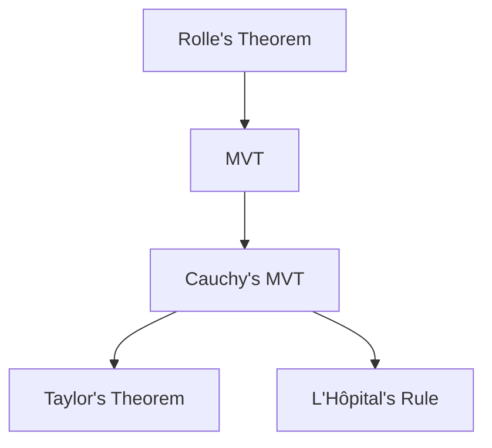

Related: [[12.1.4 Differentiation theory]] · [[12.1.6 Intermediate & Extreme Value Theorems]] · [[12.1.8 Taylor's Theorem]]

---

## Rolle's Theorem

### Statement

**Theorem**: If $f$ is:
1. Continuous on $[a,b]$
2. Differentiable on $(a,b)$
3. $f(a) = f(b)$

Then there exists $c \in (a,b)$ such that $f'(c) = 0$.

> [!info] Tao Reference
> See *Analysis I* (4th ed.), Chapter 10: Differentiation of Functions, Section 10.3 (pp. 265-268)

```desmos-graph
y = x^3 - x
y = 0
x = [-1.5, 1.5]
```

### Geometric Interpretation

If a smooth curve starts and ends at the same height, it must have a horizontal tangent somewhere in between.

### Proof Sketch

1. By EVT, $f$ attains max and min on $[a,b]$
2. If both occur at endpoints, then $f$ is constant, so $f' = 0$ everywhere
3. Otherwise, there's an interior extremum at $c$, so $f'(c) = 0$ ∎

---

## Mean Value Theorem (MVT)

### Statement

**Theorem**: If $f$ is:
1. Continuous on $[a,b]$
2. Differentiable on $(a,b)$

Then there exists $c \in (a,b)$ such that:

$$f'(c) = \frac{f(b) - f(a)}{b - a}$$

Equivalently: $f(b) - f(a) = f'(c)(b - a)$

### Geometric Interpretation

There's a point where the tangent line is parallel to the secant line from $(a,f(a))$ to $(b,f(b))$.

```desmos-graph
y = x^2
y = 2x - 1
x = [0, 2]
```

> [!example] Physical Interpretation
> If you travel 100 miles in 2 hours, your average speed is 50 mph. MVT says at some instant, your speedometer read exactly 50 mph!

---

## Cauchy's Mean Value Theorem

### Statement

**Theorem**: If $f$ and $g$ are continuous on $[a,b]$ and differentiable on $(a,b)$, then there exists $c \in (a,b)$ such that:

$$[f(b) - f(a)]g'(c) = [g(b) - g(a)]f'(c)$$

If $g'(c) \neq 0$ and $g(b) \neq g(a)$, this becomes:

$$\frac{f'(c)}{g'(c)} = \frac{f(b) - f(a)}{g(b) - g(a)}$$

### Special Case

When $g(x) = x$, we recover the standard MVT!

---

## Applications of MVT

### 1. Proving Inequalities

**Example**: Show $|\sin(x) - \sin(y)| \leq |x - y|$.

By MVT: $\sin(x) - \sin(y) = \cos(c)(x-y)$ for some $c$.  
Since $|\cos(c)| \leq 1$, we get $|\sin(x) - \sin(y)| \leq |x-y|$.

### 2. Monotonicity Test

- If $f'(x) > 0$ on $(a,b)$, then $f$ is strictly increasing
- If $f'(x) < 0$ on $(a,b)$, then $f$ is strictly decreasing
- If $f'(x) = 0$ on $(a,b)$, then $f$ is constant

### 3. L'Hôpital's Rule

Uses Cauchy's MVT to evaluate indeterminate forms.

### 4. Error Estimates

Used in proving Taylor's theorem with remainder.

---

## Relationship Between Theorems



Rolle's Theorem is the foundation; each generalizes the previous one.

---

## Common Mistakes

> [!warning] Forgetting Hypotheses
> MVT requires BOTH continuity on $[a,b]$ AND differentiability on $(a,b)$. Check both!

> [!warning] Assuming Uniqueness
> MVT guarantees EXISTENCE of $c$, not uniqueness. There could be many such points!

> [!warning] Confusing Average and Instantaneous Rate
> MVT relates the average rate of change to SOME instantaneous rate, not ALL of them.

> [!warning] Applying to Non-Differentiable Functions
> Don't apply MVT to functions like $|x|$ on intervals containing 0!

---

## Practice Problems

Apply Rolle's Theorem:

- Verify Rolle's theorem for $f(x) = x^2 - 4x + 3$ on $[1,3]$
- Show that $x^3 + x - 1 = 0$ has exactly one real root
- Does Rolle's theorem apply to $f(x) = |x|$ on $[-1,1]$? Why or why not?

Apply MVT:

- Find all values of $c$ satisfying MVT for $f(x) = x^3$ on $[0,2]$
- Use MVT to prove that $\sqrt{1+x} < 1 + x/2$ for $x > 0$
- Show that if $f'(x) = g'(x)$ for all $x$, then $f(x) = g(x) + C$

Conceptual:

- Why is Rolle's theorem a special case of MVT?
- Explain the geometric meaning of Cauchy's MVT
- How does MVT connect local and global properties of functions?

Challenge:

- Prove that if $|f'(x)| \leq M$ for all $x$, then $f$ is Lipschitz continuous
- Use MVT to prove the AM-GM inequality
- Research: What is the Generalized Mean Value Theorem and how is it used?
