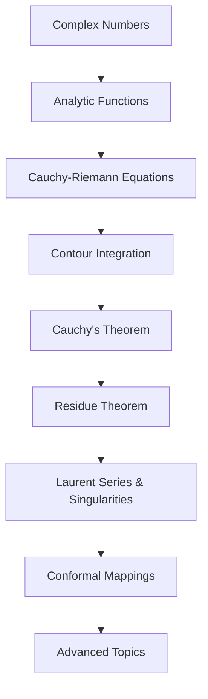

Related: [[12.4 Functional Analysis]] · [[12.5.8 Conformal mappings]] · [[6.3.10 — Introduction to Vector Calculus Integrals]]

---

## Overview

**Complex Analysis** is the study of functions of complex variables. It reveals deep connections between algebra, geometry, and analysis, with powerful applications in physics, engineering, and number theory.

### Key Concepts

- **Analytic (holomorphic) functions**: Complex-differentiable functions with remarkable properties
- **Contour integration**: Integration along paths in the complex plane
- **Cauchy's theorem**: Fundamental result linking analyticity to path independence
- **Residue theorem**: Powerful tool for evaluating integrals
- **Conformal mappings**: Angle-preserving transformations

---

## Why Study Complex Analysis?

### Theoretical Importance

1. **Rigidity**: Analytic functions are infinitely differentiable and equal to their Taylor series
2. **Global from local**: Local behavior determines global properties
3. **Elegant theorems**: Maximum modulus, Liouville's, argument principle

### Practical Applications

|Field|Application|
|---|---|
|Physics|Quantum mechanics, fluid dynamics, electromagnetism|
|Engineering|Signal processing, control theory, aerodynamics|
|Number Theory|Riemann zeta function, prime number theorem|
|Geometry|Conformal mappings, Riemann surfaces|

---

## Learning Path

---

## Core Topics

1. **[[12.5.1 Complex numbers]]** - Foundation: arithmetic, geometry, polar form
2. **[[12.5.2 Analytic functions]]** - Differentiability, power series, entire functions
3. **[[12.5.3 Cauchy-Riemann equations]]** - Necessary conditions for analyticity
4. **[[12.5.4 Contour integration]]** - Line integrals in complex plane
5. **[[12.5.5 Cauchy's theorem]]** - Fundamental theorem and integral formula
6. **[[12.5.6 Residue theorem]]** - Evaluating integrals via residues
7. **[[12.5.7 Laurent series & singularities]]** - Expansions near singularities
8. **[[12.5.8 Conformal mappings]]** - Angle-preserving transformations
9. **[[12.5.9 Maximum modulus principle]]** - Boundary behavior
10. **[[12.5.10 Argument principle & Rouche's theorem]]** - Counting zeros and poles

---

## Historical Context

Complex analysis developed through contributions from:
- **Leonhard Euler** (1707-1783): Euler's formula, exponential function
- **Carl Friedrich Gauss** (1777-1855): Fundamental theorem of algebra
- **Augustin-Louis Cauchy** (1789-1857): Integral theorem and formula
- **Bernhard Riemann** (1826-1866): Riemann surfaces, geometric approach
- **Karl Weierstrass** (1815-1897): Power series approach

---

## Study Tips

> [!tip] How to Succeed
> 
> 1. **Visualize**: Always sketch regions, contours, and singularities
> 2. **Practice computation**: Master residue calculations and contour selection
> 3. **Understand proofs**: Key theorems build on each other
> 4. **Connect to real analysis**: Compare and contrast with real-variable calculus
> 5. **Applications**: Work problems from physics and engineering

> [!warning] Common Pitfalls
> 
> - Forgetting to check if domain is simply connected
> - Misidentifying types of singularities
> - Choosing wrong contours for residue calculations
> - Confusing branch cuts with singularities

---

## Prerequisites

- **Calculus**: Multivariable calculus, line integrals
- **Real Analysis**: Limits, continuity, differentiation
- **Linear Algebra**: Vector spaces (helpful but not essential)

---

## Next Steps

After mastering complex analysis:
- **[[12.6 Riemann Surfaces]]** - Multi-valued functions made single-valued
- **[[13. Probability Theory]]** - Characteristic functions use complex analysis
- **[[14. Number Theory]]** - Analytic number theory, Riemann hypothesis
- **[[15. Mathematical Physics]]** - Quantum mechanics, field theory
